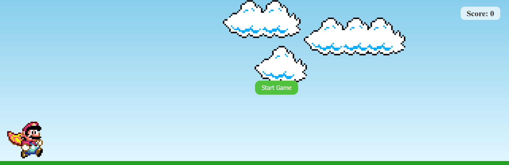

# Jumping Mario

---

## About

Jumping Mario is a simple endless runner game inspired by the Google Chrome dinosaur game. Control Mario and jump over pipes to score as many points as possible. The game gets faster as your score increases!

## Features
- Responsive design
- Start/Restart button
- Score counter
- Increasing difficulty (pipe speed)
- Keyboard and mouse controls
- Game over screen

## How to Play
- Press the **Start Game** button or hit the **Spacebar** to begin.
- Use the **Spacebar** to make Mario jump over the pipes.
- The game ends when Mario collides with a pipe.
- Your score increases the longer you survive.
- After a game over, press **Start Game** or **Spacebar** to play again.

## Controls
- **Spacebar**: Jump / Start Game
- **Mouse Click**: Start Game

## Technologies Used
- HTML5
- CSS3
- JavaScript

## Screenshots

## License

This project is licensed under the MIT License. See the [LICENSE](LICENSE) file for details.

---

